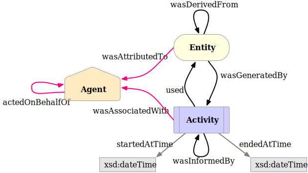
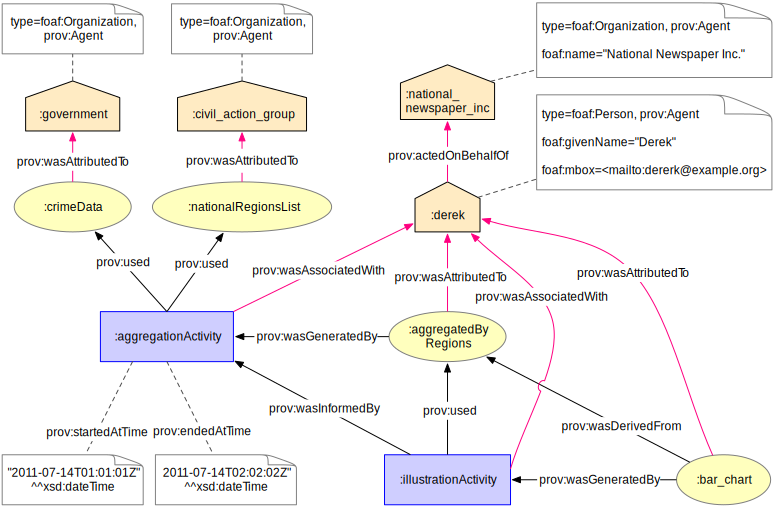

[mdp] <https://mdld.js.org/prov/>

# Starting Point Terms {=mdp:categories#starting-point .mdp:Category label}

The Starting Point category is a small set of classes and properties that can be used to create simple, initial provenance descriptions. Three classes provide a basis for the rest of PROV-O:

-   An **prov:Entity** {+prov:Entity !prov:category} is a physical, digital, conceptual, or other kind of thing with some fixed aspects; entities may be real or imaginary.
-   An **prov:Activity** {+prov:Activity !prov:category} is something that occurs over a period of time and acts upon or with entities; it may include consuming, processing, transforming, modifying, relocating, using, or generating entities.
-   An **prov:Agent** {+prov:Agent !prov:category} is something that bears some form of responsibility for an activity taking place, for the existence of an entity, or for another agent's activity.

The three primary classes relate to one another and to themselves using the properties shown in the following figure.

Activities start and end at particular points in time (described using properties **prov:startedAtTime** {+prov:startedAtTime !prov:category} and **prov:endedAtTime** {+prov:endedAtTime !prov:category}, respectively) and during their lifespan can use and generate a variety of Entities (described with **prov:used** {+prov:used !prov:category} and **prov:wasGeneratedBy** {+prov:wasGeneratedBy !prov:category}, respectively). For example, a blog writing activity may use a particular dataset and generate a bar chart. By expressing usage and generation, one can construct provenance chains comprising both Activities and Entities.

In addition, we can say that an Activity **prov:wasInformedBy** {+prov:wasInformedBy !prov:category} another Activity to provide some dependency information without explicitly providing the activities' start and end times. A **prov:wasInformedBy** relation between Activities suggests that the informed Activity used an Entity that was generated by the informing Activity, but the Entity itself is unknown or is not of interest. So, the **prov:wasInformedBy** property allows the construction of provenance chains comprising only Activities.

Provenance chains comprising only Entities can be formed using the **prov:wasDerivedFrom** {+prov:wasDerivedFrom !prov:category} property. A derivation is a transformation of one entity into another. For example, if the Activity that created the bar chart is not known or is not of interest, then we can say that the bar chart **prov:wasDerivedFrom** the dataset. Arbitrary RDF properties can be used to describe the fixed aspects of an Entity that are interesting within a particular application (for example, the file size and format of the dataset, or the aspect ratio of the bar chart).

While the properties **prov:used**, **prov:wasGeneratedBy**, **prov:wasInformedBy**, and **prov:wasDerivedFrom** can be used to construct provenance chains among Activities and Entities, Agents may also be ascribed responsibility for any Activity or Entity within a provenance chain. An Agent's responsibility for an Activity or Entity is described using the properties **prov:wasAssociatedWith** {+prov:wasAssociatedWith !prov:category} and **prov:wasAttributedTo** {+prov:wasAttributedTo !prov:category}, respectively. Agents can also be responsible for other Agents' actions. In this case of delegation, the influencing Agent **prov:actedOnBehalfOf** {+prov:actedOnBehalfOf !prov:category} another Agent that also bears responsibility for the influenced Activity or Entity.

The properties rdf:type and rdfs:label are used to express prov:type and prov:label, respectively.

***

## Example

### TTL

### MDLD

