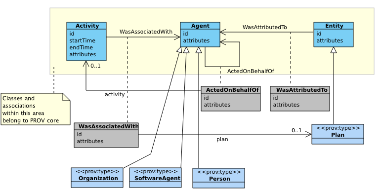
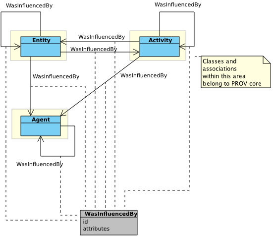

[mdp] <https://mdld.js.org/prov/>

# Agents, responsibility and influence {=mdp:components#agents-responsibility .mdp:Component label}

8 classes: {!prov:component}

-   Agent {=prov:Agent}
-   Association {=prov:Association}
-   Attribution {=prov:Attribution}
-   Delegation {=prov:Delegation}
-   Organization {=prov:Organization}
-   Person {=prov:Person}
-   Plan {=prov:Plan}
-   Role {=prov:Role}
-   SoftwareAgent {=prov:SoftwareAgent}

9 properties: {!prov:component}

-   actedOnBehalfOf {=prov:actedOnBehalfOf}
-   hadPlan {=prov:hadPlan}
-   hadRole {=prov:hadRole}
-   influenced {=prov:influenced}
-   qualifiedAssociation {=prov:qualifiedAssociation}
-   qualifiedAttribution {=prov:qualifiedAttribution}
-   qualifiedDelegation {=prov:qualifiedDelegation}
-   wasAssociatedWith {=prov:wasAssociatedWith}
-   wasAttributedTo {=prov:wasAttributedTo}
-   wasInfluencedBy {=prov:wasInfluencedBy}

