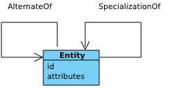

[mdp] <https://mdld.js.org/prov/>
[owl] <http://www.w3.org/2002/07/owl#>

# Alternate {=mdp:components#alternate .mdp:Component label}

## alternateOf {=prov:alternateOf .owl:ObjectProperty label}

Connects two [entities] {+prov:Entity ?domain ?range} as describing the same thing from multiple perspectives - a sub-property of the [alternate] {+prov:alternate ?subPropertyOf} property - it's a [symmetrical] {+prov:alternateOf ?prov:inverse} relation.

> Two alternate entities present aspects of the same thing. These aspects may be the same or different, and the alternate entities may or may not overlap in time. {comment @en}

Related: [specializationOf] {+prov:specializationOf ?seeAlso}

## specializationOf {=prov:specializationOf .owl:ObjectProperty label}

> An entity that is a specialization of another shares all aspects of the latter, and additionally presents more specific aspects of the same thing as the latter. In particular, the lifetime of the entity being specialized contains that of any specialization. Examples of aspects include a time period, an abstraction, and a context associated with the entity. {comment @en}

Connects two [entities] {+prov:Entity ?range ?domain} where one is a more specific version of the other.

Sub-property: [alternateOf] {+prov:alternateOf ?subPropertyOf ?seeAlso}

Inverse: [generalizationOf] {prov:inverse}

## Summary

The PROV-O Alternate component provides sophisticated mechanisms for expressing relationships between entities that represent the same underlying thing in different ways. This component answers the essential question: "How do these entities relate to the same reality, and what perspectives do they represent?"

At its heart, this component addresses the fundamental challenge of modeling how multiple entities can simultaneously represent the same concept while differing in format, perspective, or specificity. The alternateOf relation captures symmetric relationships where entities describe the same thing from different viewpoints - such as the same document in PDF and Word formats, or the same dataset in raw and processed states. This enables organizations to track how information flows through different representations while maintaining clear understanding of their underlying unity.

The specializationOf relation provides hierarchical modeling where one entity represents a more refined or specific version of another. This creates clear lineage chains where entities evolve through addition of specific aspects, contexts, or temporal boundaries. For example, a research paper might specialize into a conference presentation by adding presentation-specific context while maintaining the core research content. This supports sophisticated understanding of how concepts are refined and adapted for different purposes.

Together, these relations enable powerful provenance scenarios across diverse domains. Document management systems can track format conversions and version evolution while maintaining clear understanding of content continuity. Data platforms can model how raw data transforms into processed formats while preserving the relationship to the same underlying information. Research workflows can capture how studies evolve into publications while maintaining clear attribution to original findings.

By providing both symmetric alternation and asymmetric specialization relationships, the component becomes essential for managing complex information ecosystems where entities exist in multiple forms and evolve through hierarchical refinement. It enables organizations to maintain semantic clarity while supporting the flexibility needed for real-world provenance scenarios.