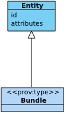

[mdp] <https://mdld.js.org/prov/>
[owl] <http://www.w3.org/2002/07/owl#>

# Bundles {=mdp:components#bundles .mdp:Component label}

The fourth component of PROV-DM is concerned with bundles, a mechanism to support provenance of provenance. Figure 9 depicts a UML class diagram for the fourth component. It comprises a Bundle class defined as a subclass of Entity. 

## Bundle {=prov:Bundle .Class label}

> A bundle is a named set of provenance descriptions, and is itself an Entity, so allowing provenance of provenance to be expressed. {prov:definition @en}

> Note that there are kinds of bundles (e.g. handwritten letters, audio recordings, etc.) that are not expressed in PROV-O, but can be still be described by PROV-O. {comment @en}

A bundle's identifier id identifies a unique set of descriptions.

A bundle is a named set of descriptions, but it is also an [entity] {+prov:Entity ?subClassOf} so that its provenance can be described.

A prov:Bundle is a named set of provenance descriptions, which may itself have provenance. The named set of provenance descriptions may be expressed as PROV-O or any other form. The subclass of Bundle that names a set of PROV-O assertions is not provided by PROV-O, since it is more appropriate to do so using other recommendations, standards, or technologies. In any case, a Bundle of PROV-O assertions is an abstract set of RDF triples, and adding or removing a triple creates a new distinct Bundle of PROV-O assertions.

## Summary

The PROV-O Bundles component enables "provenance of provenance" by treating collections of provenance descriptions as entities themselves. This powerful concept allows recursive provenance tracking where provenance records can have their own provenance, creating multi-layered documentation of documentation processes.

At its core, bundles represent a sophisticated approach to provenance management where sets of provenance descriptions become first-class entities. This enables organizations to track not just what happened to their data and processes, but also track how their provenance records themselves evolve over time. Each bundle identifier represents a unique, immutable set of descriptions that can be referenced, versioned, and managed as distinct units of provenance information.

The recursive nature of bundles provides the foundation for complex provenance scenarios. A bundle might contain provenance about data processing workflows, which itself could be part of a larger bundle describing organizational provenance policies. This creates hierarchical provenance structures that support sophisticated audit trails, compliance documentation, and multi-level accountability frameworks.

By enabling provenance of provenance, the component becomes essential for organizations that need to track how their provenance systems change, evolve, and are governed. It supports complex scenarios like regulatory reporting where organizations must demonstrate not just data lineage, but also the evolution of their tracking and documentation practices. This recursive capability makes bundles uniquely powerful for establishing trust, maintaining auditability, and supporting sophisticated provenance analysis across multiple organizational and temporal dimensions.
- Provenance collection provenance