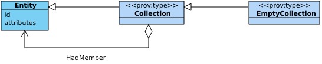

[mdp] <https://mdld.js.org/prov/>
[owl] <http://www.w3.org/2002/07/owl#>

# Collections {=mdp:components#collections .mdp:Component label}

The sixth component of PROV-DM is concerned with the notion of collections. A collection is an entity that has some members. The members are themselves entities, and therefore their provenance can be expressed. Some applications need to be able to express the provenance of the collection itself: e.g. who maintains the collection (attribution), which members it contains as it evolves, and how it was assembled. The purpose of Component 6 is to define the types and relations that are useful to express the provenance of collections. 

## Collection {=prov:Collection .Class label}

Sub-class of [Entity] {+prov:Entity ?subClassOf}

> A collection is an entity that provides a structure to some constituents, which are themselves entities. These constituents are said to be member of the collections. {prov:definition @en}

The prov:Collection [entity] {+prov:Entity ?subClassOf} class can be used to express the provenance of the collection itself: e.g. who maintained the collection, which members it contained as it evolved, and how it was assembled. The prov:hadMember property is used to assert membership in a collection.

Has a subclass - **Empty Collection** {=prov:EmptyCollection .Class label !subClassOf} - *An empty collection is a collection without members.* {prov:definition @en}

## hadMember {=prov:hadMember .owl:ObjectProperty label}

Connects a [Collection] {+prov:Collection ?domain ?prov:sharesDefinitionWith} to its [member] {+prov:Entity ?range} with a relation that is a sub-property of [wasInfluencedBy] {+prov:wasInfluencedBy ?subPropertyOf}.

Inverse: [wasMemberOf] {prov:inverse}

## Summary

The PROV-O Collections component enables provenance tracking for collections as first-class entities, modeling how groups of items maintain their own evolution while tracking membership relationships. This component answers the essential question: "How do collections evolve, and what entities do they contain?"

Collections represent a powerful concept where entities themselves become members of larger, structured entities. This creates hierarchical provenance where collections can be tracked through their own lifecycle - creation, modification, and evolution - while simultaneously maintaining precise membership information about their constituent entities. The component provides the foundation for understanding complex systems where items are grouped, organized, and managed as coherent units.

The hadMember relationship establishes clear membership chains that support sophisticated analysis of collection evolution, item tracking, and organizational structure. The bidirectional properties enable flexible querying - both "What items does this collection contain?" and "What collections include this item?" - while the entity nature of collections ensures they inherit all provenance capabilities of individual entities, from attribution to derivation relationships.

By treating collections as entities with their own provenance, the component becomes essential for dataset management, repository systems, and research aggregation. It enables organizations to maintain complete audit trails for both individual items and their groupings, support complex organizational structures, and understand how collections evolve through addition, removal, and reorganization of their constituent entities.