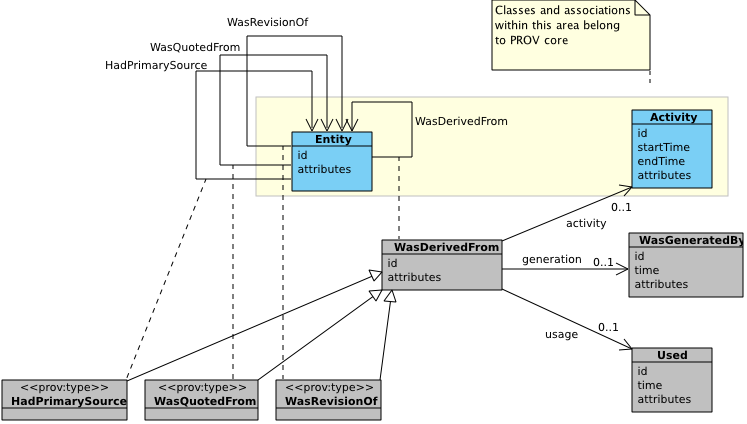

[mdp] <https://mdld.js.org/prov/>

# Derivations {=mdp:components#derivations .mdp:Component label}

The second component of PROV-DM is concerned with: derivations of entities from other entities and derivation subtypes WasRevisionOf (Revision), WasQuotedFrom (Quotation), and HasPrimarySource (Primary Source). Figure 6 depicts the third component with PROV core structures in the yellow area, including two classes (Entity, Activity) and binary association WasDerivedFrom (Derivation). PROV extended structures are found outside this area. UML association classes express expanded n-ary relations. The subclasses are marked by the UML stereotype "prov:type" to indicate that the corresponding types are valid values for the attribute prov:type.

5 classes:  {!prov:component}

-   Derivation {=prov:Derivation}
-   Influence {=prov:Influence}
-   PrimarySource {=prov:PrimarySource}
-   Quotation {=prov:Quotation}
-   Revision {=prov:Revision}

11 properties:  {!prov:component}

-   hadActivity {=prov:hadActivity}
-   hadGeneration {=prov:hadGeneration}
-   hadPrimarySource {=prov:hadPrimarySource}
-   hadUsage {=prov:hadUsage}
-   qualifiedDerivation {=prov:qualifiedDerivation}
-   qualifiedInfluence {=prov:qualifiedInfluence}
-   qualifiedPrimarySource {=prov:qualifiedPrimarySource}
-   qualifiedQuotation {=prov:qualifiedQuotation}
-   qualifiedRevision {=prov:qualifiedRevision}
-   wasDerivedFrom {=prov:wasDerivedFrom}
-   wasQuotedFrom {=prov:wasQuotedFrom}
-   wasRevisionOf {=prov:wasRevisionOf}
