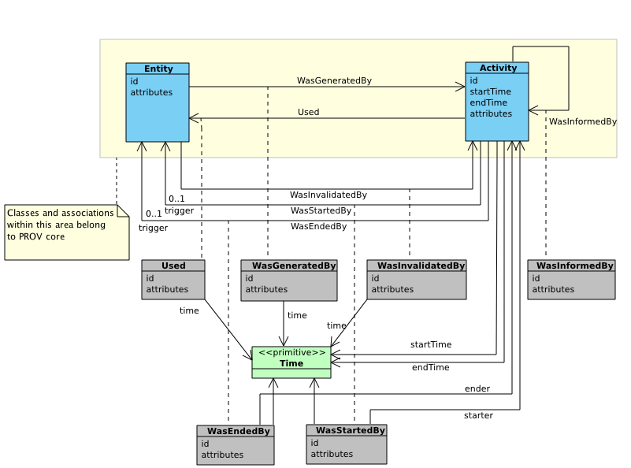

[mdp] <https://mdld.js.org/prov/>

# Entities and Activities {=mdp:components#entities-activities .mdp:Component label}

The first component of PROV-DM is concerned with entities and activities, and their interrelations.

includes 9 classes: {!prov:component}
- Activity {=prov:Activity}
- Communication {=prov:Communication}
- End {=prov:End}
- Entity {=prov:Entity}
- Generation {=prov:Generation}
- InstantaneousEvent {=prov:InstantaneousEvent}
- Invalidation {=prov:Invalidation}
- Start {=prov:Start}
- Usage {=prov:Usage}

and 19 properties: {!prov:component}

- atTime {=prov:atTime}
- endedAtTime {=prov:endedAtTime}
- generated {=prov:generated}
- generatedAtTime {=prov:generatedAtTime}
- invalidated {=prov:invalidated}
- invalidatedAtTime {=prov:invalidatedAtTime}
- qualifiedCommunication {=prov:qualifiedCommunication}
- qualifiedEnd {=prov:qualifiedEnd}
- qualifiedGeneration {=prov:qualifiedGeneration}
- qualifiedInvalidation {=prov:qualifiedInvalidation}
- qualifiedStart {=prov:qualifiedStart}
- qualifiedUsage {=prov:qualifiedUsage}
- startedAtTime {=prov:startedAtTime}
- used {=prov:used}
- value {=prov:value}
- wasEndedBy {=prov:wasEndedBy}
- wasGeneratedBy {=prov:wasGeneratedBy}
- wasInformedBy {=prov:wasInformedBy}
- wasInvalidatedBy {=prov:wasInvalidatedBy}
- wasStartedBy {=prov:wasStartedBy}